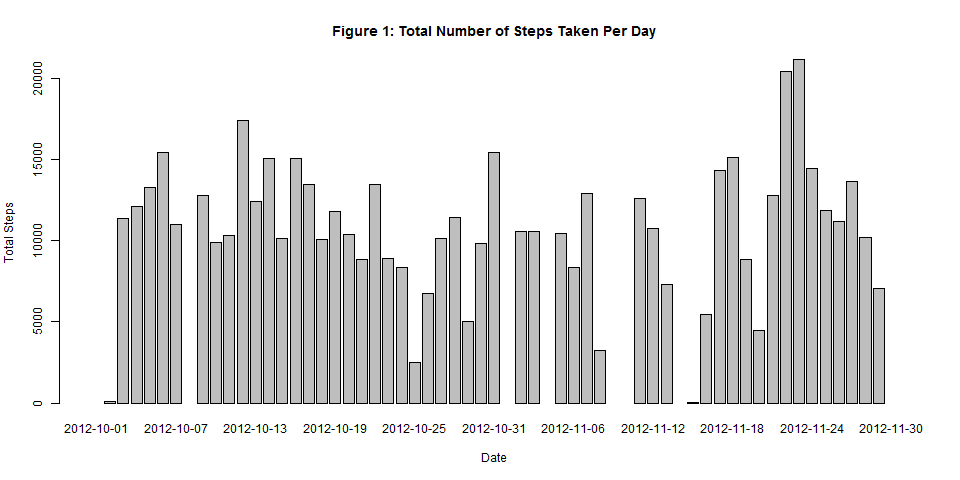

# Reproducible Research: Peer Assessment 1


## Loading and preprocessing the data


```r
myfile <- read.csv(unz("activity.zip", "activity.csv"), header = TRUE, 
                   stringsAsFactors = FALSE)
myfile$date <- as.Date(myfile$date)
```

## What is mean total number of steps taken per day?


```r
library(dplyr)
options(digits = 2, scipen = 3)
gdate <- group_by(myfile, date)
tsteps <- summarise(gdate,steps = sum(steps))
mean_steps <- mean(tsteps$steps, na.rm = T)
median_steps <- median(tsteps$steps, na.rm = T)
png("figure/1.png", width = 960)
barplot(tsteps$steps, names.arg = tsteps$date, ylab = "Total Steps", xlab = "Date", main = "Figure 1: Total Number of Steps Taken Per Day")
dev.off()
```
Here is a histogram of the total number of steps taken per day:



The mean total number of steps taken per day is **10766.19**.

The median total number of steps taken per day is **10765**.

## What is the average daily activity pattern?


```r
ginterval <- group_by(myfile, interval)
msteps <- summarise(ginterval, steps = mean(steps, na.rm = T))
png("figure/2.png", width = 960)
with(msteps, plot(x = interval, y = steps, type = 'l', ylab = 'Average Number of Steps Taken', xlab = '5-minute Interval (min)'), main = "Figure 2: Average Daily Activity Pattern")
dev.off()
maxinterval <- filter(msteps, steps == max(msteps$steps))
```

Here is a time series plot of the 5-minute interval and the average number of steps taken, averaged across all days:


The 5-minute interval of **835** contains the maximum number of steps, which is **206.17**.

## Imputing missing values

*Use the mean for that 5-minute interval to fill in all of the missing values and a new file named 'new_file' was created.*


```r
bool_nas <- is.na(myfile[, 1])

new_file <- myfile
num_rows <- nrow(myfile)
for (i in 1:num_rows) {
  if (bool_nas[i]) {
    tmp <- filter(msteps, interval == new_file[i, 3])
    new_file[i, 1] <- tmp$steps
  }
}
```

*The following code was to make a histogram of total number of steps taken per day with the data in new_file.*


```r
new_gdate <- group_by(new_file, date)
new_tsteps <- summarise(new_gdate,steps = sum(steps))
new_mean_steps <- mean(new_tsteps$steps, na.rm = T)
new_median_steps <- median(new_tsteps$steps, na.rm = T)
png("figure/3.png", width = 960)
barplot(new_tsteps$steps, names.arg = new_tsteps$date, ylab = "Total Steps", xlab = "Date", main = "Figure 3: Total Number of Steps Taken Per Day")
dev.off()
```

The total number of missing numbers in the dataset is **2304**.

Here is a histogram of the total number of steps taken per day:


The mean total number of steps taken per day is **10766.19**.

The median total number of steps taken per day is **10766.19**.

The values have little difference from the estimates from the first part of the assignment. Imputing missing data caused the subtle change of median on the estimates of the total daily number of steps.

## Are there differences in activity patterns between weekdays and weekends?

*Create a new fator variable in the dataset with two levels.*


```r
fac_var <- function(d) {
    tmp <- "weekend"
    if (weekdays(d) %in% c("星期一", "星期二", "星期三", "星期四", "星期五")) {
        tmp <- "weekday" 
    }
    tmp
}

new_file <- mutate(new_file, week = sapply(date, fac_var))
new_file$week <- as.factor(new_file$week)
```

*Make a panel plot containing a time series plot of the 5-minute interval and the average number of steps taken, averaged across all weekday days or weekend days.*


```r
library(ggplot2)
gweek <- group_by(new_file, week, interval)
new_msteps <- summarise(gweek, steps = mean(steps))
png("figure/4.png", width = 960)
qplot(y = steps, x = interval, data = new_msteps, facets = week~., geom = "line", color = week, ylab = "Average Number of Steps Taken", xlab = "5-minute Interval (min)", main = "Figure 4: Average Daily Activity Pattern")
dev.off()
```

Here is a time series plot of the 5-minute interval and the average number of steps taken, averaged across all weekday days or weekend days:


From the Figure 4, we can tell as follows:

-   People do more activities after 10:00am on weekend days.

-   People stay up late and get up late on weekend days.

-   People do more activities in the morning on weekday days.

The results above explained that people usually work on weekdays and relax on weekends.
