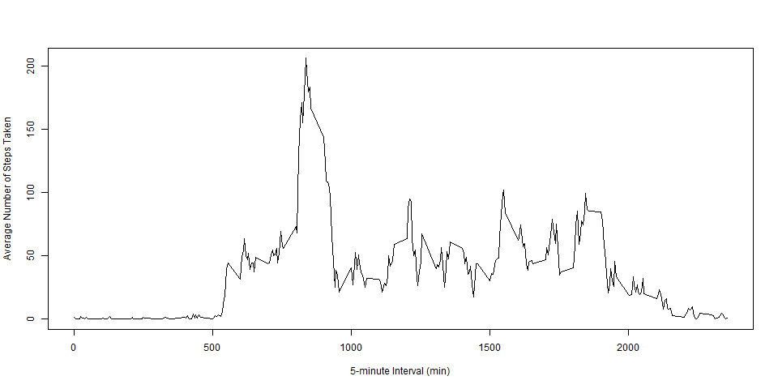

# Reproducible Research: Peer Assessment 1


## Loading and preprocessing the data


```r
myfile <- read.csv(unz("activity.zip", "activity.csv"), header = TRUE, 
                   stringsAsFactors = FALSE)
myfile$date <- as.Date(myfile$date)
```

## What is mean total number of steps taken per day?


```r
library(dplyr)
options(digits = 2, scipen = 3)
gdate <- group_by(myfile, date)
tsteps <- summarise(gdate,steps = sum(steps))
mean_steps <- mean(tsteps$steps, na.rm = T)
median_steps <- median(tsteps$steps, na.rm = T)
png("figure/1.png")
barplot(tsteps$steps, names.arg = tsteps$date, ylab = "Total Steps", xlab = "Date", main = "Figure 1: Total Number of Steps Taken Per Day")
dev.off()
```
Here is a histogram of the total number of steps taken per day:


The mean total number of steps taken per day is **10766.19**.

The median total number of steps taken per day is **10765**.

## What is the average daily activity pattern?


```r
ginterval <- group_by(myfile, interval)
msteps <- summarise(ginterval, steps = mean(steps, na.rm = T))
png("figure/2.png")
with(msteps, plot(x = interval, y = steps, type = 'l', ylab = 'Average Number of Steps Taken', xlab = '5-minute Interval (min)'), main = "Figure 2: Average Daily Activity Pattern")
dev.off()
maxinterval <- filter(msteps, steps == max(msteps$steps))
```

Here is a time series plot of the 5-minute interval and the average number of steps taken, averaged across all days:



The 5-minute interval of **835** contains the maximum number of steps, which is **206.17**

## Imputing missing values


## Are there differences in activity patterns between weekdays and weekends?
